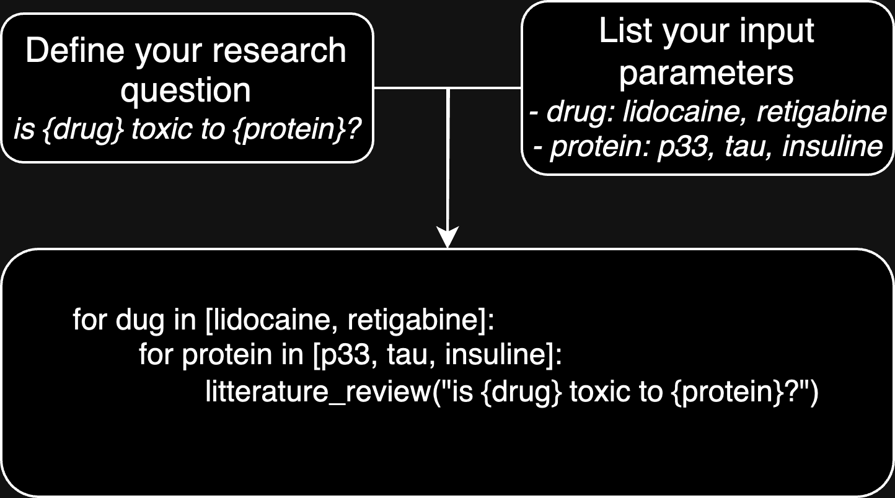

# scholar2sql

scholar2sql streamlines literature reviews by automatically extracting structured data from scholarly papers and storing it in a SQL database. This package offers two key advantages: automated literature review processing (parsing, extraction, and structured organization of key information) and generalized <b>literature screening</b> through customizable <i>input parameters</i> broadening the scope of your research question.

This tool was used for the creation of the sql table of th drug screening literature search on ion channel found [here on channelpedia](https://channelpedia.epfl.ch/drug_mapping). The configuration file is located in the <i>examples</i> folder of this repository.

## Concept

### 1- <u>Human-like</u> literature review:
<details open>
    <summary>colapse</summary>
    <figure markdown>
        
        <br/><br/>
        <figcaption>Scholar2sql mimics human research methods by: (1) querying Pubmed to find relevant papers, and (2) analyzing each paper individually to extract key features.</figcaption>
    </figure>
</details>
<br/>

### 2- <u>Screening</u> literature review:
<details open>
    <summary>colapse</summary>
    <figure markdown>
        
        <br/><br/>
        <figcaption>Once you devined your research question along with the input paramters, scholar2sql will loop over them and for each will extract the features and fill the sql table.</figcaption>
    </figure>
</details>
<br/>

## Installation

```
git clone https://github.com/journeadrien/scholar2sql.git
pip install .
```

## Usage

1. Create a YAML configuration file, many field are required (see Configuration section for details), it is a long process, take your time!
2. To enable pdf parsing, start a grobid service (I recomand using [docker here](https://grobid.readthedocs.io/en/latest/Grobid-docker/))
3. Try loading the config and resolve validation error

```bash
s2s_load_settings path_to_config.yaml # s2s_load_settings examples/ic_drug.yaml
```
3. reset sql talbe
```bash
s2s_reset_sql_table path_to_config.yaml # s2s_reset_sql_table examples/ic_drug.yaml
```
4. run
```bash
s2s_run path_to_config.yaml # s2s_run examples/ic_drug.yaml
```
## Configuration

The package requires a YAML configuration file to specify various settings. Below is an explanation of each section in the configuration file:

### SQL Database Configuration

| Field    | Description                                     | Required |
|----------|-------------------------------------------------|----------|
| host     | Database host (use "localhost" for local)       | Yes      |
| username | Database username                               | Yes      |
| password | Database password                               | Yes      |
| database | Name of the database                            | Yes      |
| table    | Name of the table (will be created if not exist)| Yes      |

#### Metadata Configuration

| Field    | Description                                                  |  Default                           |
|----------|--------------------------------------------------------------|-------------------------------------|
| to_save  | Metadata to add to sql (["pubmed_id", "format", "sections"]) | ["pubmed_id", "format", "sections"] |

### Logging Configuration

| Field             | Description                         | Options                  | Default |
|-------------------|-------------------------------------|--------------------------|---------|
| level             | Logging level for the main package  | debug, info, warn, error | info    |
| external_packages | Logging level for external packages | debug, info, warn, error | error   |

### Scholar Search Configuration

| Field                    | Description                                             | Required | Default |
|--------------------------|---------------------------------------------------------|----------|---------|
| top_sections_per_article | Number of top sections to select per article using BM25 | No       | 5       |
| email                    | Email for PubMed and Unpaywall API                      | Yes      |         |

#### PubMed Configuration

| Field                      | Description                                        | Required | Default      |
|----------------------------|----------------------------------------------------|----------|--------------|
| top_articles_per_search   | Number of top articles to select per PubMed search | No       | 10           |
| api_key                    | PubMed API key                                     | No       | ""           |
| additional_search_keywords | Additional keywords to include in PubMed search    | No       | ""           |
| tmp_pmc_folder             | Folder to store PubMed Central XML files           | No       | tmp/pmc      |
| tmp_abstract_folder        | Folder to store abstracts from PubMed              | No       | tmp/abstract |

#### GROBID Configuration

| Field          | Description                                | Required | Default |
|----------------|--------------------------------------------|----------|---------|
| url            | URL of the GROBID service                  | Yes      |         |
| tmp_pdf_folder | Folder to store downloaded PDF files       | No       | tmp/pdf |
| tmp_tei_folder | Folder to store TEI files (GROBID format)  | No       | tmp/tei |

### OpenAI Configuration

| Field       | Description                               | Required | Default    |
|-------------|-------------------------------------------|----------|------------|
| token       | OpenAI API key                            | Yes      |            |
| model       | Name of the OpenAI model to use           | No       | gpt-o-mini |
| temperature | OpenAI API key                            | No       | 0.         |
| verbose     | Whether to display full prompts           | No       | False      |

### Data Processing Configuration

| Field               | Description                                           | Required | Default |
|---------------------|-------------------------------------------------------|----------|---------|
| overwrite_existing  | Whether to overwrite existing records in the database | No       | False   |

### Prompt Configuration

This section defines the research goal, questions, input parameters, and output features for the literature review.

#### Research Goal and Question

| Field                    | Description                                              | Required | Default |
|--------------------------|----------------------------------------------------------|----------|---------|
| research_goal            | Overall goal of the literature search review             | Yes      |         |
| information_to_exclude   | Information to be excluded from the analysis             | No       | ""      |
| research_question        | Specific question to be answered (use {} for variables)  | Yes      |         |

#### Input Parameters

Define the input parameters of interest (e.g., drugs, proteins, compounds). You can have multiple inputs.

| Field       | Description                                   | Required | Default |
|-------------|-----------------------------------------------|----------|---------|
| name        | Name of the input parameter                   | Yes      |         |
| description | Description of the input parameter            | No       | ""      |
| max_length  | Maximum length of the input value             | Yes      |         |
| value       | List of possible values for the parameter     | Yes      |         |

For each value:

| Field        | Description                                             | Required | Default |
|--------------|---------------------------------------------------------|----------|---------|
| name         | Main name of the value                                  | Yes      |         |
| pubmed_alias | Aliases to be used in PubMed search (JSON list format)  | No       | ""      |
| llm_aliases  | Aliases to be used for LLM extraction (JSON list format)| No       | ""      |

#### Output Features

Define the features you want to extract from the literature.

| Field            | Description                                       | Required | Default |
|------------------|---------------------------------------------------|----------|---------|
| name             | Name of the output feature                        | Yes      |         |
| description      | Description of the output feature                 | No       | ""      |
| data_type        | Data type of the feature (e.g., str, int, dict)   | Yes      |         |
| required         | Whether the field is required in the LLM output   | No       | True    |
| multiple_values  | Whether the feature expects a list of values      | No       | False   |
| max_length       | Maximum length of the feature value (for strings) | Yes      |         |
| allowed_values   | List of allowed values (if applicable)            | No       | None    |

For allowed values:

| Field       | Description                           | Required | Default |
|-------------|---------------------------------------|----------|---------|
| name        | Name of the allowed value             | Yes      |         |
| alias       | Alias to be used by the LLM           | No       | ""      |
| description | Description of the allowed value      | No       | ""      |

#### Examples

Provide examples to guide the LLM's behavior. Each example should include:

- input_parameters
- sections (mocked article content)
- output_features (expected output)

## Contributing

Contributions are welcome! Please feel free to submit a Pull Request.
